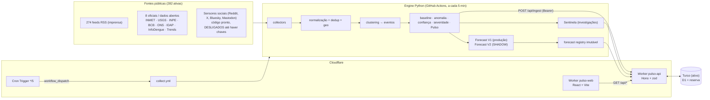
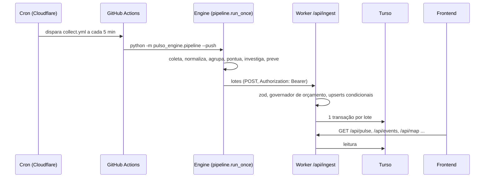

# PULSO — Overview técnico e executivo

> **Instantâneo de 2026-10-03.** Tudo aqui foi conferido contra o repositório, os testes e a produção naquele dia; os números de produção mudam a cada ciclo de 5 minutos. Onde algo **não** está provado, o documento diz `INSUFFICIENT_DATA`, `UNVERIFIED` ou `OPEN`. O PULSO **não** é provado como preditor.

## 1. O que é o PULSO

**PULSO é uma plataforma de inteligência situacional baseada em sinais públicos. Não é um portal de notícias.**

Ele funciona como um *sensor de anomalias* sobre o Brasil: coleta continuamente dados públicos (feeds de imprensa, alertas oficiais, dados abertos), mede o que está **fora do normal** por lugar e tema, agrupa sinais em **eventos**, atribui a cada evento **severidade** e **confiança** separadas, resume o momento do país num **Pulso (0–100)** e emite **previsões experimentais** com probabilidade registrada antes e pontuada depois.

Problema que resolve: uma notícia isolada não diz se algo é raro. O PULSO responde, com método e com a evidência à vista: *"o que está acontecendo agora, em que lugar, quão fora do normal, quão confirmado, e o que a história sugere para a próxima hora"*, sem fingir certeza.

O que o PULSO **não** faz (regras do projeto):
- Não prevê eleição, candidato vencedor, ranking nem "perigo" de candidato.
- Não usa LLM para gerar probabilidade; probabilidade só vem de estatística registrada.
- Não faz reconhecimento facial, rastreio de pessoas nem perfil individual.
- Não contorna login, CAPTCHA, paywall, limite de taxa ou proteção anti-hotlink.
- Não trata alegação política como fato; rede social nunca confirma um evento sozinha.

### 1.1 Vocabulário: cada termo é uma coisa diferente

| Termo | O que é | Onde vive |
|---|---|---|
| **FATO** | O que realmente aconteceu no mundo. O PULSO **nunca** afirma saber; só observa rastros. | fora do sistema |
| **SINAL** | Uma observação normalizada de uma fonte (uma matéria, um alerta, uma leitura), com `source_class`, hora, hash e geo. | tabela `signals` |
| **ANOMALIA** | Quanto a atividade de um escopo×categoria está fora do baseline histórico (0 quando não há histórico válido). | `engine/pulso_engine/anomaly.py`, `baseline.py` |
| **EVENTO** | Agrupamento de sinais sobre a mesma história, só publicado com 2+ fontes independentes, fonte oficial ou notícia de impacto. | tabela `events` |
| **CONFIDENCE** (0–100) | Quão **corroborado** está o evento: fontes independentes, tipos de fonte, confirmação oficial, consistência, contradição. | `scoring/confidence.py` |
| **SEVERITY** (0–100) | Quão **grave** seria o impacto, independente de estar confirmado. | `events.stats_for` |
| **PULSO** (0–100) e **nível 1–5** | Resumo ponderado de severidade, confiança, velocidade, diversidade, anomalia, recência, persistência e alcance. Mede **atividade**, não dano nem veracidade. | `scoring/pulse.py` |
| **FORECAST** | Probabilidade calibrável de algo no futuro, registrada antes e pontuada depois. Sempre `EXPERIMENTAL` até haver evidência. | `forecast.py`, `forecast_v2*.py` |

Severidade e confiança são **independentes** de propósito: incêndio possivelmente grande com um só relato = severidade 92, confiança 31; acidente pequeno confirmado por PRF, imprensa e trânsito = severidade 35, confiança 98 (`docs/SCORING.md`).

### 1.2 Três coisas que não se misturam

| Eixo | Pergunta | Estado hoje |
|---|---|---|
| **SOFTWARE CORRECTNESS** | O código faz o que diz? | 533 testes Python e 62 do Worker passam; typecheck e build do monorepo passam. `MODERATE` (`docs/engineering/RELIABILITY_SCORECARD.md`). |
| **OPERATIONAL RELIABILITY** | Roda sozinho, falha com segurança, dá para operar? | Coleta a cada 5 min estável; `ready`, veredito no `engine-status`. Parcial: sem rate limit/WAF, storage remoto não ensaiado, frescor de conteúdo por fonte não medido. `PARTIAL`/`WEAK`. |
| **PREDICTIVE VALIDATION** | As previsões acertam mais que um baseline? | **`INSUFFICIENT_DATA`.** 28 previsões V1 resolvidas, todas negativas; Brier Skill indefinido. Nada autoriza dizer que o PULSO "prevê corretamente". |

## 2. Arquitetura



Fluxo ponta a ponta: **fontes → collectors → engine → eventos → PULSO → Sentinela → forecast → storage → Worker → frontend.**



O Engine **não** roda no Worker: roda em Python no GitHub Actions (`.github/workflows/collect.yml`, `timeout-minutes: 8`) e só envia lotes. O Worker é o único dono do banco.

## 3. Stack e infraestrutura

| Camada | Tecnologia (conferida no repo) |
|---|---|
| Engine | Python ≥ 3.11 (`engine/pyproject.toml`), **sem dependências de runtime** (só biblioteca padrão); `pytest` só em dev. CI usa 3.12. |
| API | Cloudflare Worker, Hono `^4.9`, zod `^4.1`, Wrangler `^4.40`, TypeScript `^5.9`, Vitest `^3.2` (`apps/worker/package.json`). |
| Frontend | React `^19.2`, Vite `^7`, TypeScript (`apps/web/package.json`); publicado como Worker com assets (`pulso-web`). |
| Contratos | `packages/shared` (`@pulso/shared`), espelhados em `engine/pulso_engine/models.py`. |
| Banco | **Turso ativo** (`DB_BACKEND="turso"` em `apps/worker/wrangler.jsonc`); D1 continua como binding de reserva. Ver §11. |
| Agendamento | Cron da Cloudflare (`*/5 * * * *`) aciona o workflow de coleta; `healthcheck.yml` roda em `17,47 * * * *`. |
| CI/CD | GitHub Actions, 9 workflows (`.github/workflows/`). Node 22. |

Workflows: `ci.yml` (PR em `main`/`hen`), `deploy.yml` (merge na `main`), `collect.yml`, `healthcheck.yml`, `social-check.yml`, `turso-schema.yml`, `turso-migrate.yml` (manual), `turso-check.yml`, `turso-verify-worker.yml`.

## 4. Estrutura do repositório

| Caminho | Conteúdo |
|---|---|
| `engine/pulso_engine/` | Motor Python (módulos abaixo). |
| `engine/pulso_engine/collectors/` | `news/` (rss, gdelt), `official/` (inmet, usgs, inpe_fires, bcb_ptax, ons_ear, idap_cap, infodengue), `social/` (bluesky, mastodon, reddit, x, google_trends). |
| `engine/pulso_engine/processing/` | normalizer, geo, geo_v2, clustering, cluster_refine, importance, event_types, keyword_engine. |
| `engine/pulso_engine/scoring/` | confidence, confidence_v2, pulse, national_pulse, severity_v2. |
| `engine/pulso_engine/research/` | Sentinela: sentinel, deep_search, validator, history, query_expansion. |
| `engine/pulso_engine/intelligence/` | anomaly_v2, context_engine, driver_validator, event_escalation, event_fingerprint, sensor_reliability, signatures, trends, emerging_terms. |
| `engine/pulso_engine/validation/` | Laboratório de confiabilidade (Codex): metrics, replay, temporal, reliability_gate, forecast_registry, shadow_compare, scenarios, report. |
| `engine/config/` | `sources.json` (catálogo), `cameras.json`, `event_types.json`, `event_signatures.json`. |
| `engine/data/` | Gazetteer IBGE (`br_municipalities.json`). |
| `engine/tests/` | 90 arquivos de teste Python; `reliability/` e `golden/` (Codex). |
| `apps/worker/` | API (`src/routes/`, `src/lib/`, `tests/`). |
| `apps/web/` | Interface (`src/components/`, `src/lib/api.ts`). |
| `packages/shared/` | Contratos TypeScript. |
| `database/` | `migrations/` (0001–0004, aplicadas no D1), `pending/` (0005–0011, aplicadas no Turso), `seeds/`. |
| `scripts/` | `agentbus.py` (coordenação), `merge_when_green.sh`, `build_gazetteer.py`, `simplify-geo.mjs`. |
| `docs/` | Arquitetura, API, decisões (ADRs 0001–0009), fontes, engenharia, pesquisa, confiabilidade. |

## 5. Sensores e fontes

Auditoria do catálogo (`engine/config/sources.json`), medida em 2026-10-03: **291 cadastradas, 282 ativas**.

| Tipo | Ativas |
|---|---|
| RSS de imprensa | 274 (`NEWS_REGIONAL` 202, `NEWS_HIGH` 60, mais feeds oficiais) |
| Oficiais / dados abertos | INMET (alertas), USGS (sismos), INPE (focos de fogo), BCB (PTAX), ONS (reservatórios), IDAP/Defesa Civil (CAP), InfoDengue |
| Social | 1 (Google Trends); Reddit, X, Bluesky e Mastodon têm **adaptador pronto, desligado** até haver chaves e autorização |
| Câmeras | 59 no catálogo (`engine/config/cameras.json`): 16 com prévia embutida e link para a origem, 43 só com link (placeholder) |

Produção às 18:24Z de 2026-10-03 (`GET /api/stats`): 269 de 282 fontes online, 709 sinais nas últimas 2 h, 6.390 em 24 h, 1.016 eventos ativos, 27 UFs com atividade.

Câmeras: o PULSO é **placeholder** — mostra prévia só onde o provedor permite incorporar e leva ao site de origem ao clicar; não contorna anti-hotlink (ver `docs/sources/CAMERAS.md`).

## 6. Do sinal ao evento

1. **Normalização** (`processing/normalizer.py`): título/texto, hash, URL canônica; descarta chamadas de edição de telejornal.
2. **Proveniência e dedup:** cópias da mesma matéria contam como **uma** origem; *publisher* não é *origin* (o validador do Sentinela separa os dois); rede social nunca confirma sozinha.
3. **Geo** (`processing/geo.py`, e `geo_v2.py` atrás da flag `GEO_V2`): V1 em produção; V2 usa o gazetteer do IBGE (**5.571 municípios**, centroides, população) e exige contexto de lugar; nome ambíguo devolve `None` (vale mais abster-se do que inventar município). `GEO_V2` está **desligada**; só liga depois de corpus rotulado independente.
4. **Clustering** (`processing/clustering.py`): a matéria nova precisa se parecer com ≥25% dos membros do grupo; `cluster_refine.py` (flag `CLUSTER_REFINE`, desligada) só funde grupos com vetos rígidos. Limitação conhecida: o `event_id` pode mudar quando o agrupamento é recalculado.
5. **Publicação:** vira evento o que tem 2+ fontes independentes, ou fonte oficial com categoria, ou notícia isolada de categoria de impacto.

## 7. Baseline, anomalia, confiança, severidade e PULSO

- **Baseline** (`baseline.py`): EWMA por hora do escopo×categoria; **inválido com menos de 12 h** de histórico ou histórico esparso (anomalia vale 0, nunca chute). Há baseline sazonal (hora do dia × dia da semana, `SEASONAL_BASELINE_V2`, desligada) que só faz sentido com ~3 semanas de dados.
- **Anomalia** (`anomaly.py`; V2 em `intelligence/anomaly_v2.py`, desligada).
- **Confiança** (`scoring/confidence.py`): base 10 + fontes independentes + tipos de fonte + 25 se confirmação oficial + consistência geográfica/temporal − contradição; só rede social tem teto 40 e o evento fica `DETECTED`.
- **Severidade:** base da categoria + corroboração + impacto do texto; independente da confiança.
- **PULSO (0–100)** = Σ peso×componente: severidade 20, confiança 15, velocidade 15, diversidade de fontes 15, anomalia 15, recência 10, persistência 5, alcance 5. Multiplicado por um fator de frescor (meia-vida por categoria: trânsito 1 h … saúde/política 12 h). A lista de pontos é o "POR QUE 87?". `PULSE_V2` (desligada) troca parte dos pesos por aceleração e diversidade de sensores.
- **Nível PULSO ALERT 1–5:** 1 Normal · 2 Atenção (≥30) · 3 Elevado (≥55 e confiança ≥40) · 4 Crítico (≥75, confiança ≥70, ≥2 fontes independentes) · 5 Emergência (≥90, confiança ≥85, fonte oficial). Alertas oficiais extremos (INMET, Defesa Civil) têm piso (ADR 0007). Rotina de campanha (comício, debate, pesquisa) pesa pouco de propósito. Os limiares são ponto de partida e **não** foram calibrados com dados reais.

## 8. Sentinela e Information Gain

`research/sentinel.py` é uma camada **determinística** (ADR 0009): sem LLM no caminho crítico. Detecta candidatos (escopo×categoria fora do normal), decide se **investiga** (gatilhos configuráveis) e mantém o **estado** de cada investigação (`NEW → INVESTIGATING → … → RESOLVING → CLOSED`, sem duplicar as ativas). O `deep_search.py` pesquisa **só nas fontes já cadastradas e coletadas**, com teto por ciclo e por investigação (sem raspagem, sem motor de busca externo). O `validator.py` registra contradições em vez de escolher a versão mais repetida. A memória é a tabela `signal_observations` (contagens por hora, sem conteúdo de terceiros).

- **Information Gain:** **não existe** como módulo próprio. Há orçamento e matriz de contexto por categoria, mas não há priorização de sensores faltantes por redução de incerteza. É trabalho futuro.
- **Problema aberto (RT-003):** em dia normal ruidoso a Sentinela abre investigações falsas; há teste de regressão que caracteriza a falha (`engine/tests/reliability/test_sentinel_normal_day.py`).

## 9. Forecast, calibração, abstenção e registry

| | **V1 (produção)** | **V2 (SHADOW)** |
|---|---|---|
| Código | `forecast.py`, `forecast_scopes.py`, `forecast_surge.py` | `forecast_v2.py`, `forecast_v2_features.py`, `forecast_v2_model.py` |
| Pergunta | "o Pulso do escopo será ≥ atual+10 / +20 em 60 min?" | alvo proposto: P(evento atinge PULSO ALERT ≥ 3 no horizonte) |
| Método | distribuição empírica das variações de 60 min do próprio histórico (persistência + ruído), Laplace, intervalo de Wilson | taxa-base com prior hierárquico (cidade→UF→país→global), probabilidade bruta com pesos de configuração, calibrador versionado |
| Estado | `EXPERIMENTAL` até 100 resolvidas por método e versão | experimental; **não afeta nenhuma saída pública** |

Regras comuns: probabilidade **nunca 0 nem 1**; sem histórico suficiente **não se prevê** (V1 devolve vazio; V2 responde `INSUFFICIENT_DATA`); ausência é explícita (`VALUE`/`MISSING`/`STALE`/`UNAVAILABLE`), nunca zero; incerteza sobe com sensor faltando/parado e cobertura baixa (`MIN_COVERAGE = 0.25`, `STALE_AFTER_MIN = 120`); calibrador só com ≥200 amostras (`MIN_CALIBRATION_SAMPLES`), Platt 1-D. Esses limiares são hipóteses a medir por *ablation*, não valores validados.

Trilha de auditoria (migrations em `database/pending/`): `forecast_registry` (snapshot JSON + sha256, imutável), `shadow_results` (V1×V2×desfecho, só resolvidos), `driver_registry` (só `ACTIVE` afeta previsão), `calibrators` (artefato imutável; status `candidate → active → retired`, `retired` terminal). Rotas de leitura em `/api/admin/*`.

**Gate de promoção** (nada é promovido sem passar por shadow → canário → produção): mínimo de 200 amostras resolvidas, ganho de Brier ≥ 5% sobre V1 e sobre o baseline ingênuo, sem regressão de calibração, FPR e recall.

**Evidência hoje (produção, 18:24Z):** `pulse_empirical_delta` v1 tem **28 resolvidas, 2 abertas, 4 anuladas, 0 positivos**; Brier médio 0,0155; taxa observada 0; Brier de referência 0; **Brier Skill indefinido (`null`)**. Shadow V1×V2: 0 linhas resolvidas. Conclusão formal: **`INSUFFICIENT_DATA` / `UNVERIFIED`** (`docs/research/PREDICTIVE_VALIDATION.md`).

## 10. Feature flags

`engine/pulso_engine/flags.py`, variável `PULSO_FLAG_<NOME>`. São 16; estas 3 ligam por padrão e **só gravam trilha de auditoria**: `HISTORY_OBSERVATIONS`, `SENTINEL`, `FORECAST_REGISTRY`. As outras 13 estão **desligadas**: `SEASONAL_BASELINE_V2`, `ANOMALY_V2`, `CLUSTER_REFINE`, `SEMANTIC_CLUSTERING`, `GEO_V2`, `CONFIDENCE_V2`, `SEVERITY_V2`, `PULSE_V2`, `NATIONAL_PULSE_V2`, `DRIVER_VALIDATOR`, `EVENT_ESCALATION`, `FORECAST_V2_SHADOW`, `CONTEXT_ENGINE`. Regra: o V1 fica em produção; cada V2 passa por shadow → backtest → comparação → canário.

## 11. Persistência: Turso e D1

- O **D1 estourou o limite gratuito de escrita** (100 mil linhas/dia) em 2026-10-03 (ADR 0008). A produção roda no **Turso** (`DB_BACKEND="turso"`), via `apps/worker/src/lib/turso.ts` (cliente Hrana HTTP com a mesma API do D1: `prepare/bind/first/all/run/batch`, lote transacional). Os dois bancos usam o mesmo SQL.
- **Governador de orçamento** (`lib/budget.ts`, tabela `write_budget`): normal < 60 mil linhas/dia, economia ≥ 60 mil (descarta shadow e drivers), crítico ≥ 85 mil (só o essencial).
- **Idempotência:** upserts condicionais; reenviar o mesmo lote não duplica nada (`events`, `series`, `forecasts`, `pulse_history` só gravam se algo mudou). A única exceção intencional é `source_health` (batimento). Imutáveis: `forecast_registry`, `shadow_results`, artefato de `calibrators`.
- **Retenção:** sinais/séries/observações 90 dias; registry e shadow 180 dias; investigações encerradas 30 dias.
- **Migrations:** `database/migrations/` (0001–0004) vão ao D1 no deploy; `database/pending/` (0005–0011) são aplicadas no Turso pelo workflow `Turso schema`, para não tocar o D1 sem cota.
- **Autoridade de storage:** `PARTIAL`. O ensaio com falha induzida passa localmente (rede cai, HTTP 500, resposta perdida, falha no meio do lote); o Turso remoto real e o binding D1 real **não** foram ensaiados. Limitação aberta: com resposta perdida, `write_budget` subestima. Detalhe em `docs/engineering/STORAGE_AUTHORITY.md`.

Pendente: dividir D1 (quente) e Turso (frio) quando a cota do D1 renovar.

## 12. Worker e API

Rotas públicas (`docs/api/API.md`): `/api/health`, `/api/health/live`, `/api/health/ready`, `/api/pulse` (+ `/state/:uf`, `/city/:slug`, `/history`, `/states`), `/api/events` (+ `/:id`), `/api/map`, `/api/stats`, `/api/history`, `/api/cameras`, `/api/forecasts` (+ `/:id`, `/track-record`). Escrita: `POST /api/ingest`. Internas: `/api/admin/*` (series, signals, observations, investigations, events-digest, pulse-history, forecasts/open, engine-status, overview, calibrators, forecast-registry, forecast-trajectory, shadow-results, drivers, turso-ping).

**Autenticação e segurança:**
- `POST /api/ingest` e `/api/admin/*` exigem `Authorization: Bearer`, comparação em tempo constante, **fail-closed** sem segredo.
- Token de operador separado e **opcional** (`ADMIN_TOKEN`): quando existe, só ele abre as rotas de operador; as que o Engine lê aceitam os dois. **Ainda não criado em produção** (`engine-status` mostra `admin_token_separate: false`).
- Entrada validada com zod, SQL parametrizado, corpo do ingest limitado a 8 MB (413), todo erro 4xx/5xx com `request_id` e sem stack.
- CORS por lista de origens.
- **Não há** rate limit/WAF (depende de regra no painel da Cloudflare).
- Segredos só em `wrangler secret` / GitHub Secrets; nunca no Git.

## 13. Observabilidade e health

- `GET /api/health`: banco, atraso da coleta, saúde por fonte.
- `GET /api/health/live` (processo vivo, sem banco) e `/ready`: `ready`, `degraded` (200 com motivos) ou `not_ready` (503, banco fora).
- `GET /api/admin/engine-status`: backend ativo, orçamento do dia, investigações, forecasts, registry, shadow, calibradores e um **`verdict`** (`ok`/`degraded`/`not_ready` + motivos).
- Medido em 2026-10-03 18:24Z: `ready`, última pulsação às 18:20Z.
- **Lacuna (RT-002):** HTTP 200 com conteúdo repetido/estagnado ainda não aparece como `STALE` por fonte; só se mede a idade do Pulso nacional.

## 14. Frontend

React em `apps/web/src/`. Consome a API real (`apps/web/src/lib/api.ts`); dados de demonstração só com `VITE_DEMO=1`. Telas/seções: Hero e indicador do Pulso, mapa do Brasil, painel por UF e lista de estados, cidades monitoradas, feed OSINT, mercados, previsões, histórico, briefings, câmeras, monitor de fontes, FAQ e detalhe do evento (`apps/web/src/components/`). O front **pertence a outro integrante**; a ligação de estatísticas, previsões e histórico reais está no PR #18 (`isar`). Não há testes unitários do front (só typecheck e build).

## 15. Metodologia de validação

Laboratório isolado em `engine/pulso_engine/validation/` (do Codex, red team): métricas (Brier, log loss, ECE, classificação, cobertura, lead time) com testes de borda, replay temporal com proibição de campos de desfecho (`outcome`, `resolved_at`, `resolution`), splits walk-forward e *holdout* final, gate de promoção, registry com `data_cutoff` UTC. Papéis: **Claude A** (engine/Sentinela/Forecast V2), **Claude B** (plataforma: Worker, banco, pipeline), **Codex** (mede e tenta quebrar, não edita modelo). Nada é promovido sem o Reliability Gate. Coordenação entre agentes por `scripts/agentbus.py` (`docs/agents/COORDENACAO.md`).

## 16. Testes (executados em 2026-10-03)

| Suíte | Resultado |
|---|---|
| Engine Python (`cd engine && py -m pytest`) | **533 passaram**, 24 avisos (conformidade de fontes pendente) |
| Worker (`apps/worker`, Vitest) | **62 passaram** em 11 arquivos |
| `@pulso/shared` e `@pulso/web` | sem testes (`--passWithNoTests`); só `typecheck` e `build` |
| `npm run typecheck`, `npm run build` | passam |

Total: **595 testes automatizados**. Cobertura de linhas **não** foi medida.

## 17. Final Independent Verification Gate e findings

**O relatório formal do "Final Independent Verification Gate" não está publicado no repositório** (nenhum arquivo o cita). Por isso este documento **não** declara resultado do gate. A tabela abaixo é a classificação do estado real hoje, a partir de `docs/reliability/BACKEND_TOTAL_RED_TEAM.md` (Codex) e das verificações desta sessão:

- `VERIFIED_FIXED`: corrigido **e** retestado de forma independente.
- `PARTIAL`: corrigido em parte, ou provado só localmente.
- `UNVERIFIED`: sem evidência para afirmar.
- `BLOCKED_EXTERNAL`: depende de dado, tempo ou ação humana externa.
- `OPEN`: reproduzido e ainda não corrigido (rótulo acrescentado por honestidade).

| Finding | Tema | Status | Situação |
|---|---|---|---|
| RT-001 | desfecho futuro dentro do replay (P0) | `VERIFIED_FIXED` | deny-list + regressão (`engine/tests/reliability/test_data_leakage.py`); falta schema por feature |
| RT-002 | HTTP 200 mascara conteúdo estagnado | `PARTIAL` | `ready` e `verdict` entregues; frescor por fonte `OPEN` |
| RT-003 | Sentinela abre investigação em dia normal | `OPEN` | caracterizado por teste; correção é do engine |
| RT-004 | forecast sem evidência de skill | `BLOCKED_EXTERNAL` | precisa de eventos reais e positivos |
| RT-005 | storage sem ensaio de falha | `PARTIAL` | ensaio local passa; Turso/D1 reais e `write_budget` pendentes |
| RT-006 | fontes sem revisão de termos | `BLOCKED_EXTERNAL` | 279 de 282 fontes com revisão humana pendente |
| RT-007 | hardening administrativo | `PARTIAL` | código pronto (`ADMIN_TOKEN`); falta o segredo do dono e o WAF |
| RT-008 | métricas de proveniência/clustering | `UNVERIFIED` | sem corpus medido |

As correções da plataforma (`request_id`, 413, `live`/`ready`, upserts condicionais, `ADMIN_TOKEN`) estão em `main`, com testes e verificadas em produção, **mas ainda aguardam reteste independente do Codex**; por isso nenhuma delas é `VERIFIED_FIXED`.

## 18. Limitações reais

- Previsão **não validada**: 0 positivos observados; Forecast V2 em sombra, 0 amostras resolvidas.
- Sentinela barulhenta; Information Gain inexistente.
- `GEO_V2`, baseline sazonal e demais V2 desligados; baseline sazonal precisa de semanas de dados; o buraco de histórico de 5,7 h em 2026-10-03 é permanente.
- Independência de fontes é hipótese, sem curva medida de republicações; `event_id` pode mudar entre rodadas.
- Sem rate limit/WAF; token admin ainda compartilhado; Turso/D1 reais não ensaiados.
- Frescor de conteúdo por fonte não medido; sem p50/p95 de frescor nem custo por fonte.
- Sem corpus histórico completo (0 de 9 eventos e 0 de 8 janelas negativas, segundo o scorecard do Codex).
- A prévia de câmera depende do provedor permitir; 37 câmeras (Skyline) são só link.

## 19. Compliance das fontes

Cada fonte tem `access`, `terms_url`, `interval_s`, `retention_days`, `display`, `reviewed_by` em `sources.json`. Acesso: 275 `public_feed`, 7 `open_data`. **Revisão humana de termos: 3 de 282 concluídas, 279 `PENDENTE`.** Isso impede chamar a confiabilidade de fonte de validada. Protocolo em `docs/COLLECTION_PROTOCOL.md`; análise por fonte em `docs/sources/SOURCES.md`. Redes sociais só entram com chave oficial e autorização.

## 20. Maturidade por subsistema

| Subsistema | Maturidade |
|---|---|
| Coleta (RSS e oficiais) | Funcional e estável em produção; revisão de termos incompleta |
| Normalização, dedup, clustering | Funcional; sem métricas de false merge/split |
| Geo | V1 em produção (fraca); V2 melhor em corpus pequeno, desligada |
| Baseline e anomalia | Funcional (EWMA); sazonal depende de dados |
| Confiança, severidade, Pulso | Funcional e documentado; limiares não calibrados |
| Sentinela | Núcleo existe; barulhenta; sem Information Gain |
| Forecast V1 | Em produção, `EXPERIMENTAL`, não validado |
| Forecast V2 | Shadow; sem amostras |
| Storage | Funcional no Turso; `PARTIAL` na prova de falha |
| Worker/API | Sólido no código; borda (WAF, segredo admin) `PARTIAL` |
| Observabilidade | Melhorou (`ready`, `verdict`); frescor por fonte ausente |
| Frontend | Em evolução por outro integrante |

## 21. Próximos passos

Lista completa e viva em `docs/engineering/FALTA_FAZER.md`. Em resumo: (1) medir frescor de conteúdo por fonte; (2) calibrar a Sentinela contra o dia normal; (3) criar `ADMIN_TOKEN`/`PULSO_ADMIN_TOKEN` e regra de rate limit/WAF; (4) mover a contagem de `write_budget` para dentro da transação e ensaiar Turso/D1 reais; (5) corpus histórico com positivos e *hard negatives*, depois ablation e calibração fora do tempo; (6) revisão humana das 279 fontes; (7) chaves de Reddit/X/Bluesky e piloto de 48 h; (8) separar D1 e Turso quando a cota renovar.

## 22. Como executar, testar e fazer deploy

**Executar localmente** (README):
```bash
npm install
npm run dev:worker          # API em http://127.0.0.1:8787 (D1 local)
npm run dev:web             # interface em http://localhost:5173
cd engine
py -m pytest                # testes do motor
py -m pulso_engine.pipeline # uma rodada completa, sem enviar nada
py -m pulso_engine.audit    # o que cada fonte entrega agora
```
Variáveis do Engine para enviar de verdade: `PULSO_API_URL` e `PULSO_INGEST_TOKEN` (o token nunca vai ao Git).

**Testar** (o que o CI roda):
```bash
npm run typecheck && npm test && npm run build
cd engine && py -m pytest
```

**Deploy:** automático a cada merge na `main` (`.github/workflows/deploy.yml`): valida → aplica `database/migrations` no D1 → publica o Worker (`pulso-api`) → publica o front (`pulso-web`) → verifica `/api/health`. Merge só com CI verde (`bash scripts/merge_when_green.sh <PR>`). O fluxo de branches é `hen`/`thig`/`art`/`isar` → PR → `main`; nenhuma outra branch. Migrations de `database/pending/` não vão pelo deploy: são aplicadas no Turso pelo workflow `Turso schema`. Segredos (`INGEST_TOKEN`, `TURSO_URL`, `TURSO_TOKEN`, `GH_DISPATCH_TOKEN`, opcional `ADMIN_TOKEN`) ficam em `wrangler secret`; nunca no repositório. Atenção: `docs/DEPLOY.md` ainda descreve o fluxo anterior ao Turso.

## 23. Documentação relevante

- Entrada: [README.md](README.md) · [AGENTS.md](AGENTS.md) · [docs/OVERVIEW_PARA_AGENTES.md](docs/OVERVIEW_PARA_AGENTES.md) · [docs/ONBOARDING_BACKEND.md](docs/ONBOARDING_BACKEND.md) · [docs/BACKEND_STATUS.md](docs/BACKEND_STATUS.md)
- Arquitetura e método: [docs/architecture/ARCHITECTURE.md](docs/architecture/ARCHITECTURE.md) · [docs/architecture/PREDICTION.md](docs/architecture/PREDICTION.md) · [docs/SCORING.md](docs/SCORING.md) · [docs/api/API.md](docs/api/API.md)
- Operação: [docs/RUNBOOK.md](docs/RUNBOOK.md) · [docs/DEPLOY.md](docs/DEPLOY.md) · [docs/PENDENCIAS_DO_DONO.md](docs/PENDENCIAS_DO_DONO.md) · [docs/ATIVAR_REDES_SOCIAIS.md](docs/ATIVAR_REDES_SOCIAIS.md)
- Fontes: [docs/COLLECTION_PROTOCOL.md](docs/COLLECTION_PROTOCOL.md) · [docs/sources/SOURCES.md](docs/sources/SOURCES.md) · [docs/sources/CATALOGO_FONTES.md](docs/sources/CATALOGO_FONTES.md) · [docs/sources/GAZETTEER.md](docs/sources/GAZETTEER.md) · [docs/sources/CAMERAS.md](docs/sources/CAMERAS.md)
- Engenharia: [docs/engineering/ENGINE_AUDIT.md](docs/engineering/ENGINE_AUDIT.md) · [docs/engineering/ENGINE_V2_PLAN.md](docs/engineering/ENGINE_V2_PLAN.md) · [docs/engineering/FORECAST_V2_ENGINEERING.md](docs/engineering/FORECAST_V2_ENGINEERING.md) · [docs/engineering/BACKEND_HARDENING.md](docs/engineering/BACKEND_HARDENING.md) · [docs/engineering/STORAGE_AUTHORITY.md](docs/engineering/STORAGE_AUTHORITY.md) · [docs/engineering/FALTA_FAZER.md](docs/engineering/FALTA_FAZER.md)
- Confiabilidade e validação: [docs/reliability/BACKEND_TOTAL_RED_TEAM.md](docs/reliability/BACKEND_TOTAL_RED_TEAM.md) · [docs/engineering/RELIABILITY_SCORECARD.md](docs/engineering/RELIABILITY_SCORECARD.md) · [docs/engineering/RELIABILITY_LAB.md](docs/engineering/RELIABILITY_LAB.md) · [docs/research/PREDICTIVE_VALIDATION.md](docs/research/PREDICTIVE_VALIDATION.md)
- Decisões (ADRs): [docs/decisions/](docs/decisions/) (0001–0009; 0008 orçamento de escrita do D1, 0009 Sentinela)
- Coordenação de agentes: [docs/agents/COORDENACAO.md](docs/agents/COORDENACAO.md)
